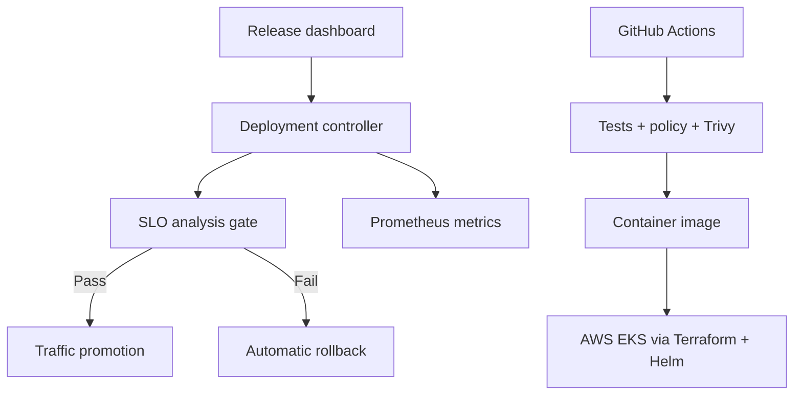

# DeployGuard Cloud Platform

DeployGuard is a working SLO-driven progressive delivery control plane. It simulates the decisions a platform team makes during a production canary release and pairs that interactive application with deployable AWS, Kubernetes, Helm, Prometheus, Docker, and CI security blueprints.

## Why this is more than a deployment demo

- Drives canary traffic through 10%, 25%, 50%, and 100% stages.
- Evaluates p95 latency and error-rate SLOs before promotion.
- Automatically rolls back a release when a gate fails and records the reason.
- Exposes Prometheus metrics and a production-style audit trail.
- Includes hardened Kubernetes manifests: non-root execution, read-only filesystem, probes, limits, HPA, PDB, and NetworkPolicy.
- Provisions a private-subnet AWS EKS control plane, ECR with image scanning, IAM, and control-plane audit logs through Terraform.
- Runs automated unit tests, policy-as-code checks, Trivy scanning, and container builds in GitHub Actions.

## Run the working demo

```bash
npm install
npm run verify
npm start
```

Open `http://localhost:8080`, start a canary, inject latency or errors, and evaluate the SLO gate to observe an automatic rollback. Prometheus-format metrics are available at `http://localhost:8080/metrics`.

## Architecture



## Repository map

- `src/` - deployment domain model and HTTP API
- `public/` - responsive operations dashboard
- `tests/` - release and rollback tests
- `deploy/helm/` - Kubernetes application chart
- `infra/terraform/` - AWS EKS/ECR/IAM/logging blueprint
- `ops/` - Prometheus configuration
- `scripts/` - policy-as-code validation
- `.github/workflows/` - verification and container security pipeline

## Honest deployment scope

The application and release controller run fully locally and are covered by automated tests. The AWS and Kubernetes assets are production-oriented infrastructure blueprints; deploying them requires an AWS account and creates billable resources.

## Author

Sukhraj Singh - Computer Science student and Network Lab Engineer co-op focused on cloud infrastructure, automation, and reliability engineering.
